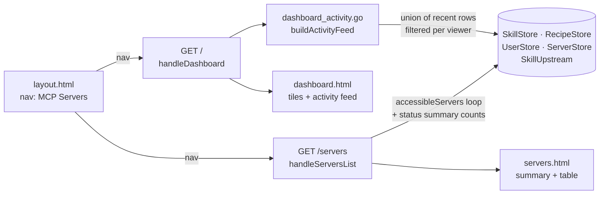

# Arc Relay Dashboard Redesign — Design

**Status:** Drafted 2026-05-06. Splits `/` and `/servers` into distinct pages — today they show the same content because `/servers` redirects to `/`. Awaiting user review before implementation.

## Goal

Make the relay's homepage a tile-based fleet overview with an activity feed, give the "Servers" nav entry a real page with the existing server table, and make the Devices tile click through to a real admin "fleet view" of all API keys. Rename the nav label to **MCP Servers** to match how operators describe what's in there.

## Motivation

The dashboard at `/` and the "Servers" tab show identical content today. `internal/web/handlers.go:778` is literally `http.Redirect(w, r, "/", http.StatusFound)`. The actual dashboard content is admin stats + per-user accessible-servers table.

Two problems:

1. The "Dashboard" doesn't function as a dashboard — it's a server list with stats stapled on top. There's no at-a-glance answer to "what's the relay holding right now?"
2. Operators see a "Servers" tab and click expecting a server-management view; they get redirected back to where they were. The nav lies.

This design splits the two concerns: `/` becomes a real overview (tiles + activity), `/servers` becomes the dedicated server list with a status summary header. No new schema; the activity feed derives from existing timestamps in the skills, recipes, users, and api_keys tables.

## Non-goals

- **Operational event log.** Server start/stop/restart history isn't recorded anywhere today; the activity feed shows only events that already have a timestamp in the database. A future `events` table is out of scope here.
- **Per-user "personalized" dashboard.** Tiles + activity stream filter to what the viewer can see (skills/recipes ACL, MCP servers accessibility), but every user gets the same layout. No "you have 3 unread" or "your recent installs" sections.
- **Real-time push.** The dashboard is a plain server-rendered page. No WebSockets, no SSE, no auto-refresh. If a value goes stale, the user reloads.
- **Devices as a first-class entity.** A "device" is defined as an API key with a recent `last_used` timestamp — see Definitions. No `devices` table, no `arc-sync init` handshake change.
- **MCP Servers card grid.** Existing tabular list moves over verbatim; visual redesign is a separate effort.

## Definitions

- **Device** — An `api_keys` row with `last_used IS NOT NULL`. "Active in last hour" = `last_used > now() - 1h`. The Devices tile reports both numbers.
- **Activity event** — A unified shape (`Kind`, `Timestamp`, `Actor`, `Subject`, `URL`, optional `Severity`) derived from existing tables. The merge function tags each row with its kind, then sorts the union by timestamp DESC.
- **Per-user filter** — A predicate applied per row in `buildActivityFeed` that hides events the viewer can't see (restricted skills/recipes they don't have access to, user-creation and key-issued events for non-admins, assignment events to other users for non-admins).

## Architecture



Key architectural choice: `dashboard_activity.go` is a separate file with one exported function. It owns the union-of-sources logic and the per-viewer filter. Easy to test in isolation against a seeded DB; easy to extend with a new event kind without touching the handler or the template.

## File-level changes

| File | Change |
|---|---|
| `internal/web/handlers.go` | `handleDashboard` rewritten to populate tile counts + call `buildActivityFeed`. `handleServersList` rewritten from a redirect into a real handler that renders the table + status summary. |
| `internal/web/templates/layout.html` | Nav label `Servers` → `MCP Servers`. One-line change. |
| `internal/web/templates/dashboard.html` | Replaced — tile grid + activity feed. |
| `internal/web/templates/servers.html` | New file — summary header (`N total · M running · K errored · J stopped`) + the existing server table extracted from old dashboard. |
| `internal/web/dashboard_activity.go` | New file — `ActivityEvent` struct, `buildActivityFeed(stores, viewer, isAdmin, limit)` function, per-viewer filter helpers. |
| `internal/store/skills.go` | New `RecentSkillVersions(limit, since)` query (joins skill_versions with skills.slug + skills.visibility for filtering). New `RecentDrift(limit, since)` (rows from skill_upstreams with non-null drift_detected_at). |
| `internal/store/recipes.go` | New `RecentRecipes(limit, since)` (rows ordered by created_at). New `RecentRecipeYanks(limit, since)`. |
| `internal/store/users.go` | New `RecentUsers(limit, since)`. New `RecentAPIKeys(limit, since)`. New `CountActiveAPIKeys(activeWindow)` returning `(total, active)`. New `ListAllAPIKeys()` for the admin fleet view (returns rows joined to usernames). |
| `internal/web/handlers.go` (api-keys path) | `handleAPIKeys` accepts `?all=1` admin-gated; pulls from `ListAllAPIKeys` and adds an Owner column. The mine-only path is unchanged. |
| `internal/web/templates/api_keys.html` | Conditional "Owner" column when `.FleetView` is true. Toggle link "View all keys (admin)" / "View only my keys" depending on mode. |
| `internal/web/api_keys_fleet_test.go` | New — admin renders fleet view with all rows + owners; non-admin `?all=1` returns 403. |
| `internal/web/dashboard_activity_test.go` | New — merge ordering, per-user filter, admin-only event kinds, limit + 30d clamp. |
| `internal/web/dashboard_test.go` | New — tile counts, scoping for non-admins, Devices tile hidden for non-admins, link targets. |
| `internal/web/servers_list_test.go` | New — summary numbers, table population, regression check that `/servers` is no longer a 302. |

## Dashboard `/` page

Two regions: tile row on top, activity feed below.

### Tile row (4 admin / 3 non-admin)

| Tile | Number | Sub-text | Click target |
|---|---|---|---|
| **Skills** | count visible to viewer | `N publicly visible · M restricted assigned to you` (admin: omit "to you") | `/skills` |
| **Recipes** | count visible to viewer | same shape as Skills | `/recipes` |
| **MCP Servers** | count accessible to viewer | `N running · M stopped · K errored` | `/servers` |
| **Devices connected** *(admin only)* | total API keys with `last_used IS NOT NULL` | `K active (last hour)` | `/api-keys?all=1` |

Whole tile is the link. Equal-width grid; wraps to 2-up on narrow screens.

### Activity feed (last 50 events, 30d window)

Single column. Each row:

```
🟢  alice published demo-skill@1.2.0                            2m ago
🟡  drift detected on docker-komodo · severity: minor           45m ago
🔵  bob granted access to internal-tool                         3h ago
🔴  demo-skill yanked                                           yesterday
🟣  recipe claude-mem published by alice                        2d ago
```

Color/emoji is a 1-char status pill so the eye can scan kind without reading. Right-side timestamp uses the existing `relativeTime` template helper (relative + absolute on hover).

**Event kinds** (v1):

| Kind | Source row | Pill | Visibility |
|---|---|---|---|
| `skill_published` | `skill_versions` | 🟢 | viewer can read the skill |
| `skill_yanked` | `skills.yanked_at` (skill-level) + `skill_versions.yanked_at` (version-level) | 🔴 | viewer can read the skill |
| `skill_drift` | `skill_upstreams.drift_detected_at` | 🟡 | viewer can read the skill |
| `skill_assigned` | `skill_assignments.assigned_at` | 🔵 | admin sees all; non-admin sees only assignments *to themselves* |
| `recipe_published` | `setup_recipes.created_at` | 🟣 | viewer can read the recipe |
| `recipe_yanked` | `setup_recipes.yanked_at` | 🔴 | viewer can read the recipe |
| `recipe_assigned` | `setup_recipe_assignments.assigned_at` | 🔵 | same as skill_assigned |
| `user_joined` | `users.created_at` | 👤 | admin only |
| `key_issued` | `api_keys.created_at` (with optional `capabilities`) | 🔑 | admin only |

**Empty state:** "No recent activity in the last 30 days."

### Per-user filtering

Centralized in `buildActivityFeed`:

- Catalog rows are filtered by `viewerCanReadSkill(viewer, skillID)` / `viewerCanReadRecipe(viewer, recipeID)` — same predicates the existing API + dashboard handlers use.
- `user_joined` and `key_issued` rows: dropped for non-admin viewers.
- `skill_assigned` / `recipe_assigned` rows: admin sees all; non-admin sees only rows where `user_id == viewer.id`.

Filtering happens after the union sort, before the limit, so the limit always reflects what the viewer actually sees (no "showing 50 events but 3 are filtered out" surprise).

## Admin fleet view of `/api-keys`

The Devices tile click target is `/api-keys?all=1`. Admin lands on a fleet view that lists every API key across every user, with `last_used` timestamps so the admin can see who's active. Non-admins requesting `?all=1` get 403 — there's no use case for non-admins seeing other users' keys, and the current `/api-keys` page already serves them their own keys.

**URL shape:** `?all=1` query param on the existing `/api-keys` route. Keeps the routing surface small (one route, one handler) and lets the same template render both modes with a conditional Owner column. Toggle link in the page header switches between the two.

**Page layout (fleet view):**

```
[ View only my keys ]   <- toggle link, top-right

API Keys (all users)

| Owner  | Name              | Profile  | Capabilities | Created   | Last Used | Status | Actions |
| alice  | mintdevbox        | default  | skills:write | 2026-04-30 | 5 min ago | Active | Revoke  |
| bob    | ci-publisher      | ci       | skills:write | 2026-05-01 | 2h ago    | Active | Revoke  |
| ian    | claude-desktop    | default  | —            | 2026-04-28 | now       | Active | Revoke  |
| ian    | legacy-key        | —        | —            | 2026-03-12 | Never     | Revoked | —      |
…
```

The Generate-new-key form at the bottom of the page is *only* shown in mine-mode (`?all=1` is a read-only fleet view; the admin can switch back to mine-mode to mint a key). Avoids confusion about "who would this new key belong to?"

**Authorization:**
- `?all=1` requires `user.Role == "admin"`. Non-admin → 403.
- The Revoke action on a fleet-view row is admin-gated (already the existing behavior since admin role bypasses the "owns key" check in `handleAPIKeyRoutes`).

**Store change:** new `UserStore.ListAllAPIKeys()` returns `[]*APIKey` with each row's `Owner` field populated via JOIN on the `users` table:

```sql
SELECT ak.id, ak.user_id, u.username AS owner_username,
       ak.name, ak.profile_id, COALESCE(ap.name, ''),
       ak.created_at, ak.last_used, ak.revoked, ak.capabilities
FROM api_keys ak
LEFT JOIN users u ON ak.user_id = u.id
LEFT JOIN agent_profiles ap ON ak.profile_id = ap.id
ORDER BY ak.last_used DESC NULLS LAST, ak.created_at DESC
```

Sort order puts most-recently-active keys at the top so the admin's eye lands on the live fleet first; never-used keys sink to the bottom but stay visible.

**Template change:** add an `Owner` field to `APIKey` (or a per-row wrapper struct local to the handler). Render the Owner column when `.FleetView` is true; hide it in mine-mode (where every row is the viewer themselves).

## MCP Servers `/servers` page

```
[12 total]  [10 running]  [1 errored]  [1 stopped]

─────────────────────────────────────────────────
| Slug        | Status   | Transport | Tools | … |
─────────────────────────────────────────────────
| outline     | running  | remote    | 15    | … |
| code_memory | running  | http      | 8     | … |
| ssh-broker  | running  | http      | 6     | … |
… (existing table)
```

Summary header: 4 inline stats, computed in one pass over `accessibleServers` (the existing helper). For non-admins, summary counts reflect *their accessible set*, so the numbers and the visible rows agree.

The table itself is the existing dashboard table, lifted into `servers.html`. Same columns, same per-row admin actions (start/stop/edit/delete), same per-user accessibility filter. Non-admins see no action buttons today; preserved.

The nav label changes to "MCP Servers" but the URL stays `/servers` — no redirect or alias needed since the page now actually exists.

## Activity feed query strategy

`buildActivityFeed` runs N small queries (one per event kind), tags each result row with a unified `ActivityEvent`, merges + sorts by timestamp DESC, applies the per-viewer filter, takes top `limit`.

```go
type ActivityEvent struct {
    Kind      string    // "skill_published", "skill_drift", etc.
    Timestamp time.Time // sort key, displayed as relative
    Actor     string    // username, may be "" for system events
    Subject   string    // human-readable target ("demo-skill@1.2.0", "docker-komodo")
    URL       string    // optional click target ("/skills/demo-skill")
    Severity  string    // optional, used by drift events ("minor", "major", etc.)
    SkillID   string    // for filtering — empty for non-skill events
    RecipeID  string    // for filtering — empty for non-recipe events
    UserID    string    // for filtering — viewer-id check on assignments
}

func buildActivityFeed(stores Stores, viewer *store.User, limit int) []ActivityEvent
```

**Performance:** at admin-scale fleets (~10s of skills, ~10s of recipes, dozens of versions/year), each `Recent*` query returns ≤ 50 rows. The merge is O(N log N) on ~250 rows max — sub-millisecond. N+1 in the visibility predicates is acceptable; the total fan-out is bounded by `limit × O(1)` lookups.

**30d window:** all `Recent*` queries take a `since time.Time` parameter; the handler always passes `time.Now().Add(-30 * 24 * time.Hour)`. Bounds the worst-case query size and keeps the feed relevant.

## Authorization

- `GET /` — any authenticated user. Tile counts and activity feed scope to what they can see.
- `GET /servers` — any authenticated user. Table scopes to accessible servers.
- Tile-link targets (`/skills`, `/recipes`, `/api-keys`) — already auth-gated by their respective handlers.
- Devices tile — admin-gated at the template level (`{{if eq .User.Role "admin"}}`).

No new endpoints, no new gates. Capabilities (`skills:write`, `recipes:write`) don't apply here — this is read-only.

## Test plan

### `internal/web/dashboard_activity_test.go` (new)

- `TestBuildActivityFeed_MergesSourcesByTimestamp` — seed events of multiple kinds at different times; assert merged feed is DESC.
- `TestBuildActivityFeed_NonAdminFiltersRestricted` — public + restricted skill events + restricted-skill assignment to alice. Alice's feed: public + her assignment. Outsider's feed: public only.
- `TestBuildActivityFeed_NonAdminHidesUserAndKeyEvents` — admin sees `user_joined` + `key_issued`; non-admin doesn't.
- `TestBuildActivityFeed_AssignmentScopedToSelf` — non-admin sees only assignments where `user_id == viewer.id`.
- `TestBuildActivityFeed_LimitAnd30DayClamp` — seed 60 events over 60 days; assert ≤50 returned, nothing older than 30d.

### `internal/web/dashboard_test.go` (new)

- `TestDashboardTiles_AdminCounts` — seeded fixture with N skills/M recipes/K servers/J keys. Render `/`. Probe `data-tile="skills"` etc. and assert exact counts.
- `TestDashboardTiles_NonAdminScopedAndDevicesHidden` — same fixture, non-admin viewer. Assert scoped counts; assert Devices tile element absent.
- `TestDashboardTiles_DeviceSubtextActiveLastHour` — seed 5 keys total, 2 with `last_used > now-1h`. Assert tile shows `5 total · 2 active (last hour)`.
- `TestDashboard_TileLinks` — assert hrefs: skills tile → `/skills`, MCP servers tile → `/servers`, etc.

### `internal/web/servers_list_test.go` (new)

- `TestServersList_AdminSummaryAndTable` — seed 4 servers (running/error/stopped/running). Render `/servers`. Assert summary `4 total · 2 running · 1 errored · 1 stopped` and all 4 rows present.
- `TestServersList_NonAdminScopedSummary` — admin scopes: 4 servers, non-admin can only see 1. Assert non-admin's summary reflects their scope (not the global numbers).
- `TestServersList_NotARedirect` — explicit regression: `GET /servers` returns 200 with HTML, not 302 to `/`.

### `internal/web/api_keys_fleet_test.go` (new)

- `TestAPIKeysFleet_AdminSeesAllRowsWithOwners` — seed keys for 3 different users; admin GET `/api-keys?all=1`; assert all rows present, each with the expected Owner column value.
- `TestAPIKeysFleet_NonAdmin403` — non-admin GET `/api-keys?all=1` → 403, body explains admin-only.
- `TestAPIKeysFleet_OrderRecentFirst` — seed 3 keys with different `last_used` values + 1 never-used; assert ordering puts most-recent first, never-used last.
- `TestAPIKeysFleet_NoCreateFormInFleetMode` — assert the rendered HTML in fleet mode does NOT contain the "Generate New API Key" form (avoids the "who would this belong to?" confusion).
- `TestAPIKeysFleet_ToggleLink` — assert mine-mode renders "View all keys (admin)" and fleet-mode renders "View only my keys".

### Reusable test rig

Generalize the existing `newDashRig` helper from `skills_dashboard_test.go` so the three test files share one builder. Adds `recipeStore` + `serverStore` to the rig (currently only carries skill store + users + sessions).

## Implementation outline

1. **`internal/store/*.go` — add `Recent*`, `CountActiveAPIKeys`, and `ListAllAPIKeys` query helpers.** ~120 lines across three files. Each is a focused `SELECT … ORDER BY ts DESC LIMIT ?`.
2. **`internal/web/dashboard_activity.go` — write the merge + filter function.** ~150 lines including the `ActivityEvent` struct, kind-specific row mappers, and per-viewer predicate.
3. **`internal/web/dashboard_activity_test.go` — write the unit tests.** ~200 lines.
4. **`internal/web/handlers.go` — rewrite `handleDashboard` to populate tiles + call `buildActivityFeed`. Rewrite `handleServersList` to render the real page. Extend `handleAPIKeys` with `?all=1` admin fleet view.** ~120 lines net.
5. **`internal/web/templates/dashboard.html` — replaced.** ~120 lines.
6. **`internal/web/templates/servers.html` — new.** ~80 lines (mostly the existing table extracted).
7. **`internal/web/templates/api_keys.html` — conditional Owner column + toggle link + fleet-mode form-suppression.** ~30 lines patch.
8. **`internal/web/templates/layout.html` — nav label patch.** 1 line.
9. **`internal/web/dashboard_test.go` + `servers_list_test.go` + `api_keys_fleet_test.go` — handler tests.** ~350 lines.

Total: ~1,150 lines, no schema migration, single commit per phase if desired (store helpers → activity function → handlers → templates → tests). Or one bundled commit; preference at implementation time.

## Open questions

1. **Should the activity feed be reachable as a paginated `/activity` page, or does the dashboard's 50-row preview suffice?** v1 ships only the dashboard preview; if users ask for more, a `/activity` page with `?since=` and `?kind=` filters is cheap to add later.

2. **30-day window vs configurable.** v1 hardcodes 30d. If operators run weekly fleet meetings and want "last 7d" specifically, the existing relative timestamps already make that obvious without a filter. Configurability is a follow-up.

These two open questions don't block implementation — the recommended defaults are listed inline; if either needs a different choice, flag at review time and the spec gets a small patch.

## Decision log

- **2026-05-06** — Drafted after observing `/servers` is just a redirect to `/`. User picked: device = active API key (cheapest signal); activity stream mixing catalog + operational + user events (with operational deferred to a future events-log feature); Devices tile shows `total · active(1h)`; same dashboard for everyone with scoped numbers and admin-only Devices tile; MCP Servers tab gets the existing table moved over plus a 4-stat summary header; nav label `Servers` → `MCP Servers`.
- **2026-05-06 (revision)** — Scope expanded: ship the admin fleet view of `/api-keys` (`?all=1` mode with Owner column and `last_used DESC` ordering) as part of this feature instead of deferring it. Devices tile click target is now `/api-keys?all=1`. This was originally Open Question #1; user resolved it by promoting the follow-up into v1.
